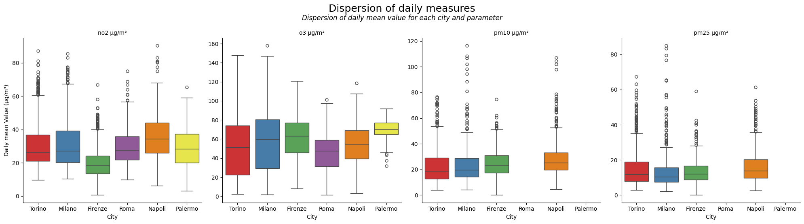
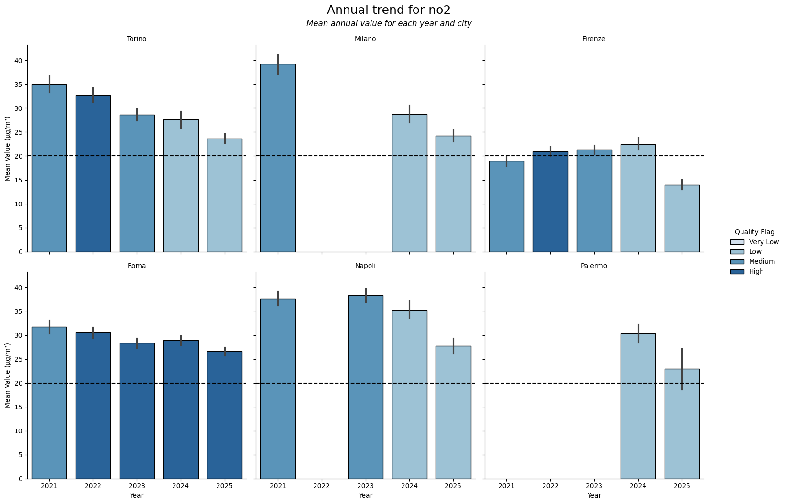
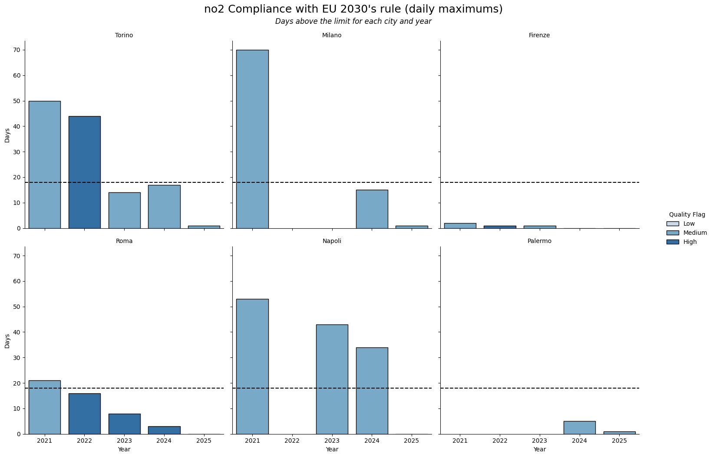

# Air Quality in Italian Cities (OpenAQ) — EU Standards vs EU 2030 Targets + Stations Deep-Dive

**A Streamlit app with the results of this analysis is avaiable at** https://air-quality-italy-and-eu-2030-openaq.streamlit.app/

### (Work in progress)

A reproducible data pipeline and analysis of four major EU-regulated air pollutants (NO₂, O₃, PM₁₀, PM₂.₅) using OpenAQ data.
The project compares city-level air quality against current EU standards and stricter 2030 targets, and includes a deep-dive on Turin to demonstrate station-level heterogeneity and robustness to aggregation choices.

**NB  EU quality standards for assessing policy compliance are much more rigid than what this anaysis can implement. Therefore, results have to be taken as exploratory rather than evaluative**

## Why this project
Urban air pollution is a high-impact, policy-relevant topic touching public health, environmental justice, and sustainable cities. EU has recently approved stricter targets to be met within January 1st 2030 (https://eur-lex.europa.eu/legal-content/EN/TXT/?uri=OJ:L_202402881#anx_I) togheter additional regulations regarding pm2.5 and other pollutants. It is therefore important, as european citizens and organizations, to confront our cities air quality with such stricter standards, in order to propose and discuss data-based environmental policies, which can improve our life quality. 

This repository aims to produce **transparent**, **reproducible**, and **quality-aware** indicators that can support evidence-based discussion. 

## Research questions
1. How far are major Italian cities from current EU thresholds and future 2030 targets for NO₂, O₃, PM₁₀, and PM₂.₅?
2. Are trends from 2021–2025 consistent with convergence toward stricter targets?
3. How robust are conclusions given sensor coverage and station-level variability?

## Scope
- **Cities (main analysis)**: Turin, Milan, Florence, Rome, Naples, Palermo
- **Period**: 2021–2025 (5 complete years)
- **Pollutants**: NO₂, O₃, PM₁₀, PM₂.₅
- **Data source**: OpenAQ (measurements + sensors metadata)

## What you get
- **Clean/aggregated dataset** (city-day-pollutant)
- **Quality coverage diagnostics** (coverage, and confidence labels)
- **Policy-oriented indicators**
  - annual means (NO₂, PM₂.₅, PM₁₀)
  - daily exceedance counts (where applicable)
  - O₃ 8-hour rolling metric (MDA8) and exceedance days (definitions in methodology)
- **Reports**
  - Main comparison across 6 cities
  - Turin deep-dive (station heterogeneity + sensitivity to aggregation)
  - Supplementary analyses

## Quick start
### 1) Setup
- Python 3.10+ recommended
- Create environment, install dependencies and package:
  - `python venv .venv`
  - `.venv/Scripts/activate` (Windows)
  - `pip install -r requirements.txt`
  - `pip install -e .`

### 2) Configure
- Copy/edit config file:
  - `config.yml` (cities, years, pollutants, thresholds, quality settings)
- Insert your OpenAQ API key in .env
  - Freely avaible by registering at https://explore.openaq.org/register

### 3) Run pipeline
- Run the pipeline entrypoint to (depending on config):
  1) fetch raw data
  2) clean + quality-filter
  3) aggregate
  4) generate tables/figures
- To run:
  - `python -m project.pipeline`

> Note: raw downloads can be large and depend on API availability. See `docs/methodology.md`

## Results (high-level)
> Interpretation note: these are **threshold-based indicators** computed by this project. They are not necessarily legal compliance determinations, because official rules involve specific quality metrics.

### Where to find results
- **Comparison with EU directives**: `results/compliance_table.csv`
- **Trend figures**: `results/plots/main/trends_annual_*.png`
- **Exceedance Days**: `results/plots/main/compliance_days_2030_*.png`
- **Coverage**: `results/quality_checks/`
- **Turin deep-dive**: station-level plots and robustness checks in the report

### Snapshots

## Repository structure outline
> not all files are included for more details see `docs/methodology.md`

  ├── data/  
  │ └── descriptive/  
  ├── reports/  
  │ ├── Supplementary/  
  │ ├── report.ipynb  
  │ └── turin_deep_dive.ipynb  
  ├── docs/  
  │ └── methodology.md  
  ├── results/  
  │ ├── plots/  
  │   ├── CAQI/  
  │   ├── density_plots/  
  │   ├── main/  
  │   └── seasonal_trends/  
  │ └── quality_checks/  
  │   ├── deepdive/  
  │   └── figures/  
  ├── src/   
  │ └── project  
  │   ├── fetch.py  
  │   ├── processing.py  
  │   ├── pipeline.py  
  │   └── results.py  
  ├── .env.example  
  ├── pyproject.toml  
  ├── config.yml  
  ├── requirements.txt  
  ├── LICENSE  
  └── CONTRIBUTING.md  

## Methodology (1-minute overview)
- Data are retrieved from OpenAQ and processed into daily and yearly city-level indicators.
- Indicators are computed with **explicit averaging periods** and **data quality rules** (coverage thresholds, invalid values filtering).
- Results are presented with a **confidence label** reflecting data completeness.
- Full details: `docs/methodology.md`.

## Limitations
- **Coverage variability (OpenAQ):** sensor availability and completeness vary by city, pollutant, and year. Results should be interpreted together with the project’s quality/coverage indicators.
- **Station representativeness:** monitoring stations are not uniformly distributed and may not represent population exposure across the whole city (hotspots vs background).
- **Heterogeneity across stations:** city-level aggregates can change depending on the aggregation method (mean vs median vs worst-station). This is explicitly explored in the Turin deep-dive.
- **Policy definitions vs descriptive indicators:** some thresholds depend on specific legal definitions (averaging periods, exceedance rules). Where the implemented metric does not match the legal compliance definition exactly, the project reports “exceedance days” as a descriptive indicator rather than a legal compliance claim.
- **Time aggregation choices:** daily/yearly indicators depend on data-quality rules (minimum hours per day, minimum valid days per year). Different reasonable choices may slightly change results.
- **No causal attribution:** the analysis is descriptive and does not attribute changes to specific interventions, meteorology, or mobility patterns.

## Data policy (what is versioned)
This repository follows a **reproducible + lightweight** data policy.

### Not versioned (generated / large / API-dependent)
- `data/raw/` (downloaded measurements, sensor lists, failures logs)
- `data/processed/` (cleaned intermediate datasets)
- `data/quality_checks/` (intermediate diagnostics produced during a run)
- full `results/` folder (can be regenerated)

These artifacts can be recreated by running the pipeline with the provided configuration.

### Versioned (small “showcase” outputs)
To make the project readable without running the pipeline, we version a curated subset of final artifacts:
- `results/plots/_report/` (selected figures used in the reports)
- `results/tables/_report/` (selected summary tables used in the reports)

> If you want to reproduce everything from scratch, follow the steps in the Quick start section.

## How to cite / reuse
If you reuse code, figures or processed data, please cite this repository and the OpenAQ data source.

## Contributing
See `CONTRIBUTING.md`. Issues and pull requests are welcome.

### Italian summary
Questo progetto costruisce una pipeline riproducibile su dati OpenAQ per confrontare NO₂, O₃, PM₁₀ e PM₂.₅ in 6 città italiane (2020–2024)
con standard UE attuali e target 2030, qualificando i risultati in base a copertura/qualità dati. Un approfondimento su Torino mostra eterogeneità tra stazioni e robustezza rispetto alle scelte di aggregazione.
